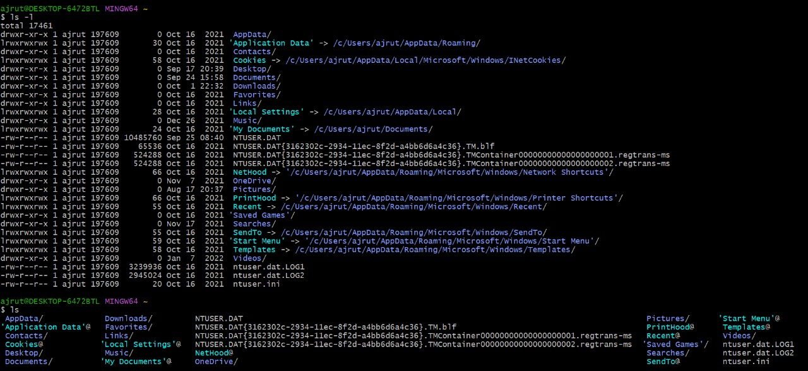
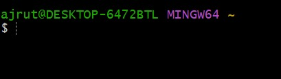

# clear

`clear` is a unix command to clear the terminal screen. 

```bash
clear
```

---

## Description

**clear** command will ignore any command-line parameters that may be present. 

Also, this command doesn’t take any argument.

#### Examples:

Before executing the command:



After executing the command:


