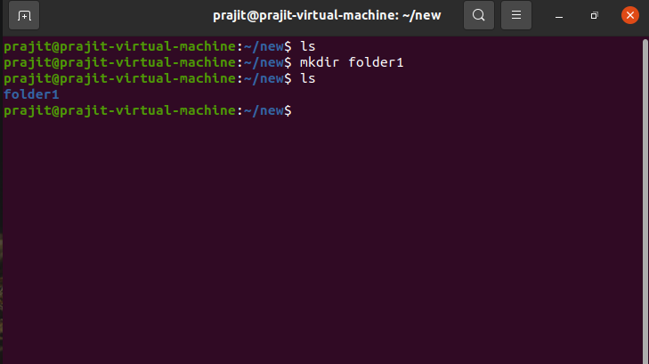

# mkdir

- "mkdir" is a command in Unix systems that allows users to create directories in the specified location. 
- The command can also be used to set directory permissions while creating them.

### Syntax: `mkdir [options] [directory_name]`

 
