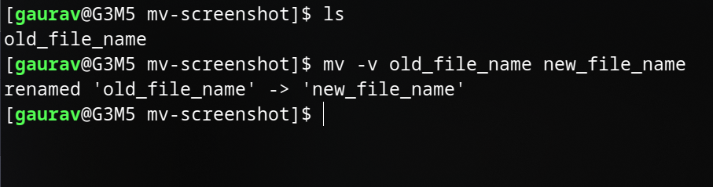
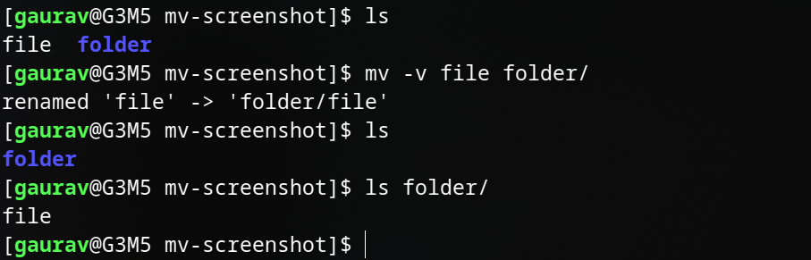

# mv

## Overview

The mv command in Unix-like operating systems is used to move or rename files and directories. It is a versatile and fundamental command for managing files and their locations. Here's how to use it:

To **move** a file or directory from one location to another:

```bash
mv [options] source destination
```

**source**: The file or directory you want to move <br>
**destination**: The location where you want to move the source to

### Example:

```bash

mv file.txt /path/to/destination/
```

#### Screenshot


To rename a file or directory, you can use mv by specifying the source and the destination path as the same directory, effectively renaming it:

```bash

mv [options] oldname newname
```
**oldname**: The current name of the file or directory.<br>
**newname**: The new name you want to give it.


### Example:

```bash
mv oldfile.txt newfile.txt
```
Here are some common options you can use with mv:

`-i`: Interactive mode; prompts for confirmation before overwriting an existing file.<br>
`-u`: Update; move only when the source is newer or the destination is missing.<br>
`-v`: Verbose; displays the files being moved.<br>

#### Screenshot



Remember to replace `[options]`, source, and destination with your specific values. The mv command is a powerful tool for file management in Unix-like systems.