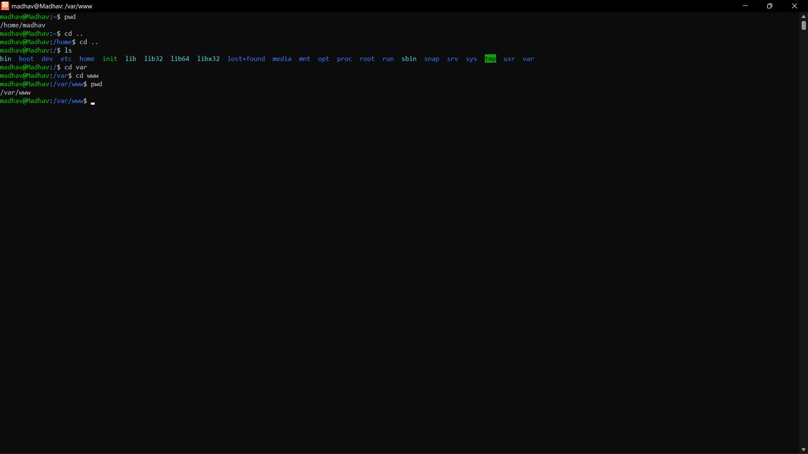

# pwd

-The pwd Linux command prints the current working directory path, starting from the root (/).
-Use the pwd command to find your way in the Linux file system structure maze or to pass the working directory in a Bash script.
-The pwd command has two flags [-L] and [-P]

### Syntax: `pwd [ -L | -P ]`

# [-L] Flag

-Displays the value of the PWD environment variable if the PWD environment variable contains an absolute path name of the current directory that does not contain the file names . (dot) or .. (dot-dot).
-Otherwise, the -L flag behaves the same as the -P flag.

# [-P] Flag
-Displays the absolute path name of the current directory.
-The absolute path name displayed with the -P flag does not contain file names that, in the context of the path name, refer to files of type symbolic link.

 
