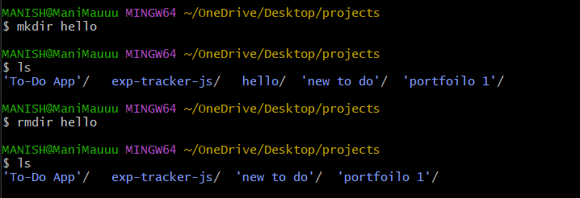

# rmdir

- rmdir command is used remove empty directories from the filesystem in Linux. 
- The rmdir command removes each and every directory specified in the command line only if these directories are empty. 
- So if the specified directory has some directories or files in it then this cannot be removed by rmdir command.

### Syntax: `rmdir [options] [directory_name]`

 

 

## Read more
You can read more on the topic [Here](https://www.geeksforgeeks.org/rmdir-command-in-linux-with-examples/)